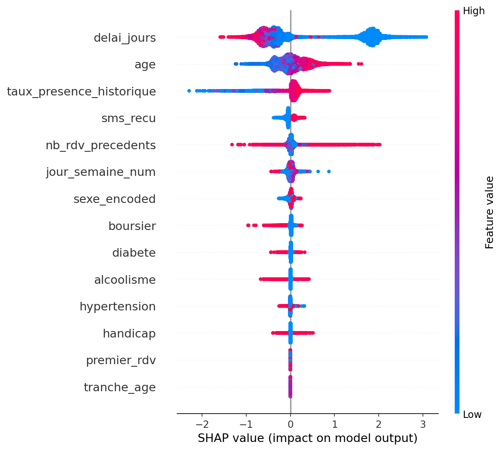
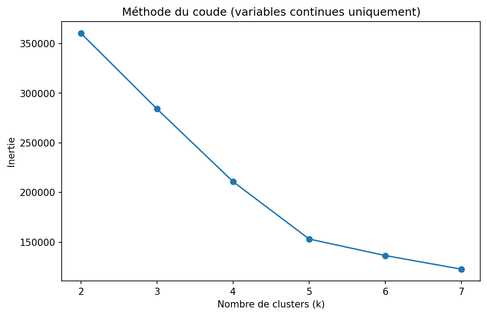
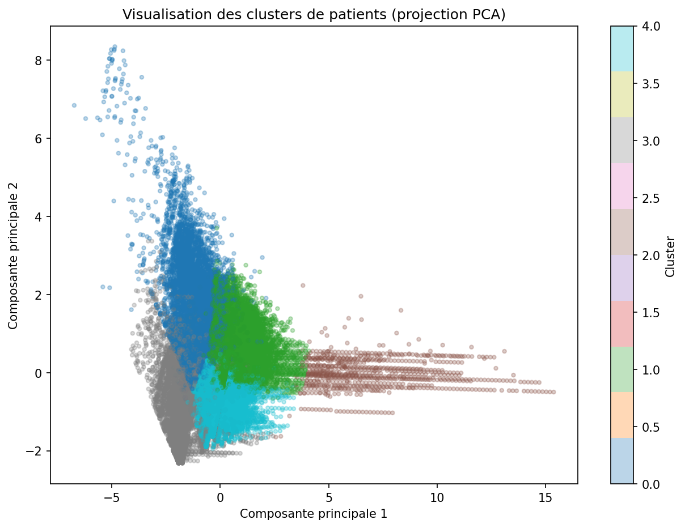

# Clinic No-Show Prediction

Prédiction et analyse des rendez-vous médicaux manqués (no-show), à partir de données réelles anonymisées de rendez-vous médicaux au Brésil (~110 000 rendez-vous, source : [Kaggle - Medical Appointment No Shows](https://www.kaggle.com/datasets/joniarroba/noshowappointments)).

Ce projet s'inscrit dans la construction d'un portfolio de data science orienté domaine médical, en s'appuyant sur une expérience professionnelle de plusieurs années en clinique.

## Contexte métier

Une clinique fait face à un problème récurrent : une partie significative des patients ne se présentent pas à leur rendez-vous, ce qui génère des créneaux perdus, une désorganisation du planning des médecins, et un coût pour la structure. L'objectif de ce projet est de répondre à trois questions :

- Quels facteurs expliquent le mieux l'absentéisme des patients ?
- Peut-on prédire, au moment de la prise de rendez-vous, la probabilité qu'un patient ne se présente pas ?
- Peut-on regrouper les patients en profils de comportement homogènes, utiles pour adapter les actions de relance ?

## Architecture du projet

```
CSV (Kaggle) → MySQL (SQL avancé) → Python (pandas / scikit-learn / XGBoost) → Analyse & modèles
```

Le choix de passer par une base relationnelle plutôt que de traiter le CSV directement en pandas est un choix délibéré : il rapproche le projet d'un contexte réel de clinique, où les données vivent dans un système relationnel, et permet de mettre en valeur des compétences SQL avancées (jointures, sous-requêtes corrélées, window functions) en plus du machine learning.

## Structure des données

Le CSV source, plat, a été normalisé en deux tables MySQL :

**`patients`** : `patient_id`, `age`, `sexe`, `quartier`, `hypertension`, `diabete`, `alcoolisme`, `handicap`

**`rendez_vous`** : `appointment_id`, `patient_id` (clé étrangère), `date_prise_rdv`, `date_consultation`, `jour_semaine`, `sms_recu`, `presence` (variable cible), `delai_jours`, `boursier`

### Nettoyage appliqué

- Renommage des colonnes d'origine (fautes de frappe du dataset source : `Hipertension`, `Handcap`)
- Suppression des lignes avec un âge invalide (négatif)
- Inversion de la variable cible : `No-show = Yes` (absent) devenue `presence = 0`, pour une lecture plus intuitive
- Binarisation de `handicap` (échelle 0-4 dans le dataset source, simplifiée en 0/1 — limite assumée, voir section Limites)
- Calcul de `delai_jours` (délai entre prise de RDV et consultation), avec correction des délais négatifs (erreurs de saisie du dataset source) ramenés à 0

## Analyse exploratoire (SQL)

L'exploration a été menée directement en SQL (jointures, agrégations conditionnelles, `FIELD()` pour un tri chronologique personnalisé, sous-requêtes corrélées). Principaux résultats :

| Facteur | Effet observé |
|---|---|
| Délai avant consultation | Effet dominant : 4.66 % d'absence pour un RDV pris le jour même, contre 33 % au-delà de 30 jours |
| Âge | Relation non linéaire : les 12-17 ans ont le taux d'absence le plus élevé (26.4 %), les 65 ans et plus le plus faible (15.5 %) |
| SMS de rappel | Effet apparent contre-intuitif en analyse univariée (plus de SMS = plus d'absence), qui s'inverse une fois le délai contrôlé — un exemple de paradoxe de Simpson : à délai égal, le SMS réduit bien le taux d'absence |
| Comorbidités | Effet réel mais modeste : hypertension et diabète associés à une meilleure présence, l'alcoolisme ne suit pas cette tendance |

## Modélisation — prédiction du no-show

### Feature engineering

En plus des variables brutes, une feature d'historique patient a été construite : `taux_presence_historique`, calculée uniquement sur les rendez-vous **antérieurs** à celui prédit, pour éviter toute fuite de données. Implémentée en deux versions :
- SQL (sous-requête corrélée), pour la démonstration de compétence SQL avancée
- pandas (`groupby` + `cumsum`), utilisée dans le pipeline de modélisation pour sa rapidité d'exécution

Les patients sans historique (premier rendez-vous) sont imputés avec le taux de présence moyen global, complétés par un indicateur binaire `premier_rdv`.

### Comparaison des modèles

Gestion du déséquilibre de classes (~20 % de no-show) via `class_weight="balanced"` (scikit-learn) et `scale_pos_weight` (XGBoost). Évaluation sur un split train/test stratifié (80/20).

| Modèle | ROC-AUC | Recall (Absent) | Precision (Absent) |
|---|---|---|---|
| Logistic Regression | 0.675 | 0.58 | 0.32 |
| Random Forest | 0.738 | 0.80 | 0.31 |
| XGBoost | 0.737 | 0.79 | 0.31 |

Random Forest et XGBoost obtiennent des performances quasiment identiques, tous deux nettement supérieurs à la régression logistique — signe que les relations entre variables sont non linéaires (cohérent avec l'interaction délai × SMS et le profil non linéaire de l'âge observés en exploration).

L'accuracy globale n'est pas retenue comme métrique de référence : avec 80 % de présents dans les données, un modèle naïf prédisant systématiquement "présent" atteindrait 80 % d'accuracy sans aucune valeur prédictive. Le recall sur la classe "Absent" est priorisé, car l'objectif métier est d'identifier un maximum de patients à risque pour cibler les actions de relance.

### Importance des features (XGBoost)

`delai_jours` domine très largement (65.8 % de l'importance), suivi de `age` (8.1 %), `taux_presence_historique` (7.9 %) et `sms_recu` (5.2 %). Ce classement confirme, côté modèle, ce que l'exploration SQL avait identifié en amont.

Une analyse SHAP complémentaire confirme le sens de ces effets (délai court → pousse vers la présence ; bon historique → pousse vers la présence) et révèle un effet supplémentaire : `nb_rdv_precedents` (fréquentation du patient) pousse vers la présence indépendamment du taux d'assiduité historique, suggérant qu'un patient fidèle à la clinique est en soi un facteur de meilleure présence.

Les modèles à base d'arbres plafonnent autour de 0.74 de ROC-AUC sans amélioration notable entre eux, ce qui suggère avoir atteint la limite de ce que les features actuelles permettent d'expliquer. Une progression ultérieure passerait probablement par l'ajout de nouvelles features (spécialité du médecin, distance domicile-clinique, historique plus fin) plutôt que par un modèle plus complexe.



## Segmentation des patients (clustering)

Objectif : faire émerger des profils de comportement à partir des seules caractéristiques patient, **sans utiliser la variable cible** (`presence`), afin de garder une validation externe possible a posteriori.

### Détermination du nombre de clusters



### Profils identifiés



### Méthodologie

Un premier essai incluant des variables binaires (comorbidités, sexe, SMS) a produit un score de silhouette faible (0.16 à 0.25), K-Means étant peu adapté au mélange de variables continues et binaires. Le clustering final a été recentré sur quatre variables continues : `age`, `delai_jours`, `nb_rdv_precedents`, `taux_presence_historique`, ce qui a nettement amélioré la séparation des groupes (silhouette jusqu'à 0.36).

Le nombre de clusters (k = 5) a été choisi par convergence entre la méthode du coude et le score de silhouette, en tenant compte également de l'interprétabilité métier du résultat.

### Profils identifiés

| Cluster | Taille | Profil | Taux de présence réel |
|---|---|---|---|
| Patients chroniques très suivis | 830 | Historique très long (~38 RDV), délai très court | 95 % |
| Seniors réguliers | 43 481 | Âge moyen 57 ans, peu d'historique, délai court | 85 % |
| Jeunes patients / RDV rapprochés | 44 279 | Âge moyen 17 ans, délai court | 81 % |
| Délais longs, assiduité modérée | 15 084 | Délai moyen ~40 jours | 69 % |
| Profil à risque d'absentéisme | 6 852 | Historique d'absences marqué (taux historique moyen 0.05) | 64 % |

Bien que la variable cible n'ait jamais été utilisée pour construire les clusters, ceux-ci se différencient nettement sur le taux de présence réel (écart de 31 points entre le groupe le plus assidu et le plus à risque), ce qui constitue une validation externe de la pertinence de la segmentation.

Une projection PCA en 2 dimensions (54 % de variance expliquée) permet une visualisation illustrative des clusters ; elle sert de support graphique et non de mesure de qualité — les métriques quantitatives (silhouette, écart de taux de présence) restent la référence pour évaluer le clustering.

## Limites et pistes d'amélioration

- **Génération des données synthétiques** : n'applique pas ici, le dataset est réel, mais reste anonymisé et daté (2016, Brésil) — les comportements observés ne sont pas nécessairement transposables tels quels à un autre contexte géographique ou temporel
- **Binarisation de `handicap`** : perte d'information (échelle 0-4 réduite à 0/1), à tester en variable numérique brute dans une itération future
- **Plateau de performance des modèles de classification** (~0.74 ROC-AUC) : suggère une limite des features actuelles plutôt qu'un problème de modèle ; pistes : spécialité médicale, distance au centre de soins, historique plus fin (délai depuis la dernière absence)
- **Variance expliquée limitée de la PCA** (54 %) : la visualisation en 2D sous-représente la séparation réelle des clusters dans l'espace à 4 dimensions

## Évolutions envisagées

Ce projet constitue une première version (MVP) pensée pour évoluer par la suite vers une architecture cloud (migration Azure SQL Database, pipeline Azure Data Factory, déploiement du modèle sur Azure Machine Learning, assistant conversationnel via Azure OpenAI), une fois cette base validée et documentée.

## Stack technique

- **Base de données** : MySQL
- **Traitement de données** : Python (pandas, SQLAlchemy, pymysql)
- **Modélisation** : scikit-learn (Logistic Regression, Random Forest), XGBoost
- **Interprétabilité** : SHAP
- **Visualisation** : Matplotlib
